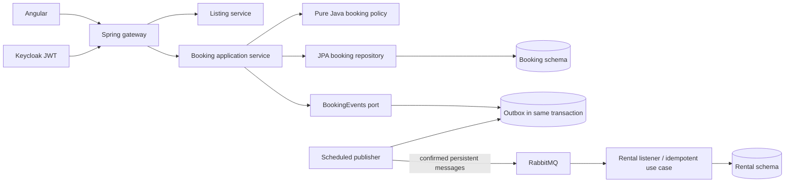

# Architecture and the personal refactoring

This repository is a personal fork of the EFREI team project [ALIF82-2526PSP01_Projet_Microservices](https://github.com/lfleury78/ALIF82-2526PSP01_Projet_Microservices). Its original authors and commit history are preserved. The following improvements are confined primarily to the booking/rental workflow; the other services have not all been redesigned.

## Existing system

Angular 21 calls the Spring gateway. Keycloak supplies JWTs. Seven Spring Boot services cover users, listings, bookings, rentals, messages, reviews and notifications. PostgreSQL contains service-specific schemas in one physical database. RabbitMQ carries domain events. This is a shared-infrastructure teaching deployment, not independently isolated production infrastructure.

## Booking boundaries

* `domain/BookingPolicy` and `BookingStatus` depend only on Java: dates, money, guests, participants and valid state transitions.
* `service/BookingService` orchestrates JPA operations and records events through `port/BookingEvents`. Its clock is injected; date rules do not depend on a hard-coded system clock.
* Controllers handle JWT identity and request validation. Ownership checks remain in use cases so HTTP is not the sole protection.
* `outbox/JdbcBookingEvents` joins the current transaction (`MANDATORY`) and writes an event alongside the booking. No broker call occurs during booking creation/confirmation/cancellation.
* `outbox/OutboxPublisher` is the infrastructure adapter. It uses PostgreSQL row locks and skips locked rows. A predecessor check emits only the oldest unsent event for each booking, preserving its order across workers.

This is an incremental separation of responsibilities. JPA entities remain mutable and use cases still depend on Spring transactions and repository interfaces. A second abstraction around every repository would add little value at this stage.

## Consistency rules

Dates represent `[check-in, check-out)`: two consecutive stays may touch at checkout. A PostgreSQL GiST exclusion constraint prevents overlapping PENDING/CONFIRMED bookings, including concurrent requests that both pass the application precheck. A JPA `@Version` field prevents confirmation/cancellation from silently overwriting a stale state.

Database checks back up date, guest count, positive price, participant and status rules. Flyway V2 fails if existing data violates them; it never silently rewrites historic bookings. `btree_gist` must be available and the migration role must be allowed to install it (or an administrator must install it first).

## Event delivery

An outbox row is deleted only after a positive correlated RabbitMQ publisher confirmation and no returned message. Broker failures, negative acknowledgements and unroutable messages leave it for the next poll. The worker stops its batch after a failure to limit time holding database locks. A crash after broker acknowledgement but before database commit can replay the event: delivery is **at least once**, not exactly once.

Rental creation uses PostgreSQL `INSERT ... ON CONFLICT (booking_id) DO NOTHING`, then reads the existing row. Replayed or concurrent confirmations therefore return the same rental without resetting its status. Genuine database failures propagate out of the listener, allowing RabbitMQ redelivery; malformed events are rejected without requeue. A dead-letter/retry policy remains outstanding.

Notification consumers have not been made idempotent. See the debt register before extending outbox delivery to other workflows.

## Access and listing deletion

Booking details require a participant identity; listing booking lists are scoped to the authenticated owner. Bulk cancellation requires a JWT and checks ownership. Listing deletion forwards the caller's JWT to booking-service and fails if cancellation cannot be completed. The process is still not an atomic distributed transaction: a delete/cancel saga and authoritative listing validation remain future work.

## Executable checks

* ArchUnit enforces framework-free domain code, controller/use-case separation, and no AMQP dependency in booking use cases.
* Unit tests cover invalid stays, money, state transitions, identities, malformed events and persistence-failure propagation.
* PostgreSQL 16 Testcontainers tests execute Flyway and JPA, check overlap protection, adjacent stays, concurrent requests, optimistic locking, transaction rollback, HTTP access and rental deduplication.
* Outbox tests use the real PostgreSQL database with a mocked RabbitTemplate for acknowledged, failed, negative and returned deliveries. They do not prove real broker restart/recovery behavior.
* Angular tests cover navigation/login and authenticated route access; production build is also checked.

The CI workflow compiles all eight Java applications, runs booking/rental tests (including PostgreSQL integration), and tests/builds Angular. Other service starter context tests require infrastructure and are not claimed as passing regression suites.
